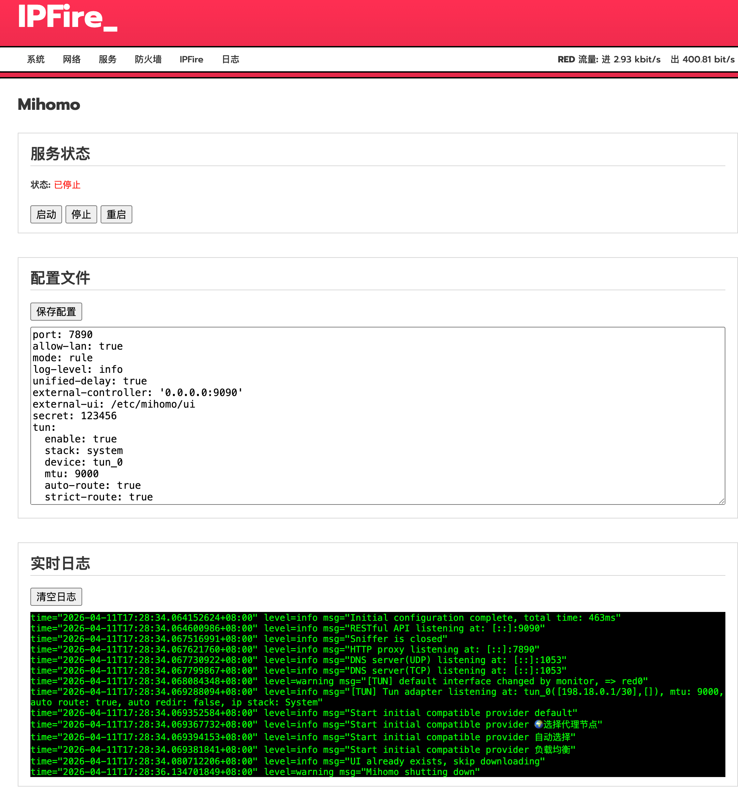

## mihomo for IPFire
控制 mihomo 运行，实现透明代理。包含配置修改、程序控制、日志查看功能。在IPFire-2.29-x86_64-Core-Update-200上测试通过。



## 集成程序
[mihomo](https://github.com/metacubex/mihomo)

## 注意事项
1. 当前仅支持x86_64 平台。
2. 脚本集成了可用的默认设置，只需替换proxies和rule部分配置即可使用。
3. 为减少长期运行保存的日志数量，在调试完成后，请将所有配置的日志类型修改为error或warn。

## 安装命令
以 root 用户登录终端，运行以下命令安装：
```bash
sh install.sh
```
## 卸载命令
以 root 用户登录终端，运行以下命令卸载：
```bash
sh uninstall.sh
```

## 配置过程
1. 安装完成，导航到 服务>Mihomo 菜单，修改配置并保存。
2. 点击启动按钮，根据输出日志内容，排除配置文件错误。
3. 为了避免 DNS 解析冲突，可以将系统 DNS 转发到 mihomo，修改/etc/unbound/unbound.conf文件，添加以下内容：
```bash
forward-zone:
    name: "."
    forward-addr: 127.0.0.1@1053
```
运行以下命令重启 unbound
```bash
/etc/init.d/unbound restart
```
4. 正常启动后，客户端访问 ip111.cn，检查分流是否正常。

## 其他事项
1. 脚本具备开机自启功能。
2. 启动mihomo后，黑名单和入侵检测列表可能无法下载。
3. 默认配置文件开启了 api 功能，访问 http://lan_ip:9090/ui 登录 Mihomo 仪表盘(metacubexd)。
